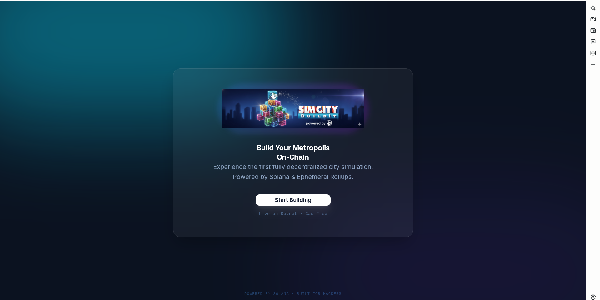
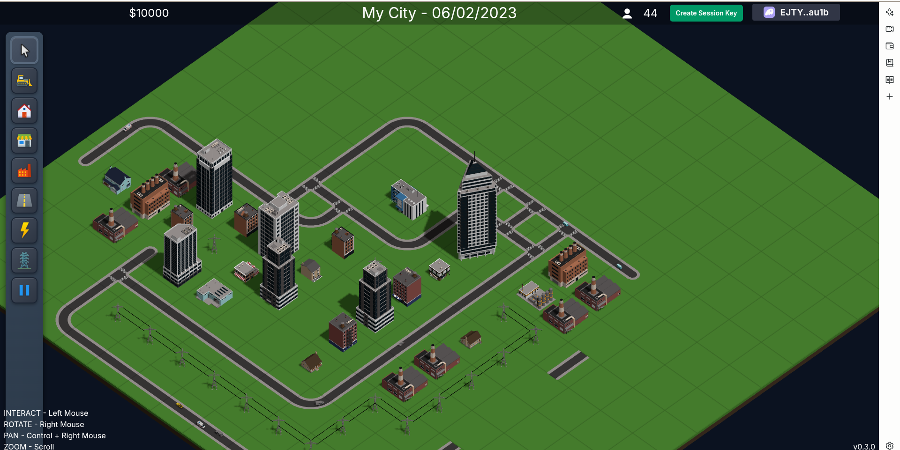

# SimCity Solana: Three.js Clone with Ephemeral Rollups

A fully functional 3D city-building simulation game that runs on the Solana blockchain, utilizing **MagicBlock Ephemeral Rollups** for high-speed, gas-free gameplay with eventual settlement on the mainnet.



## 🏗 Architecture

The project follows a hybrid architecture where the **Client** handles the rich, visual simulation (e.g., power propagation, traffic), while the **Blockchain (Ephemeral Rollup)** enforces the authoritative state (tiles, money, population) and settlement.

```mermaid
graph TD
    User[User] -->|Plays Game| Frontend[React + Three.js Frontend]
    
    subgraph "Client Side (Rich Simulation)"
        Frontend -->|Simulates Power/Traffic| GameLoop[Local Game Loop (JS)]
        GameLoop -->|Renders| ThreeJS[Three.js Renderer]
    end
    
    subgraph "Blockchain Layer (Authoritative State)"
        Frontend -->|Actions (Place/Bulldoze)| MagicBlock[MagicBlock Ephemeral Rollup]
        MagicBlock -->|Validates Rules (Rust)| GameState[Game State (ER)]
        GameState -->|Periodically Settles| SolanaMainnet[Solana Mainnet]
    end
    
    subgraph "Smart Contracts (Anchor)"
        SolanaMainnet -->|Persists| CityAccount[City Account (On-Chain)]
        CityAccount -->|Stores| TileMap[16x16 Tile Grid]
    end
```

### Components
1.  **Frontend (Web)**: Built with **React** and **Three.js**, responsible for the 3D visualization, user input, and the "rich" simulation logic (power BFS, vehicle traffic) which is too heavy for on-chain execution.
2.  **Ephemery Rollup (MagicBlock)**: Runs the **Rust-based Smart Contract** for high-frequency interactions (`place_building`, `bulldoze`). It maintains the authoritative state of the map (tiles) and economy (money) with millisecond latency and zero gas.
3.  **Solana Mainnet**: Serves as the settlement layer where the final city state is persisted and assets are owned.
4.  **Local Game Loop**: A JavaScript engine running in the browser that interpolates state between blockchain updates and handles visual-only mechanics.

---

## 🎮 Game Mechanics

 The simulation runs on a **16x16 grid** where every tile represents a specific structure or zone.

 

### 1. The Simulation Loop
The city evolves through time steps. In each `terminate` or `stepSimulation` call:
-   **Services Update**: Power and other utilities calculate their distribution.
-   **Buildings Update**: Each zone (Residential, Commercial, Industrial) executes its logic to grow or shrink based on local conditions.

### 2. Zoning & Buildings
| Zone Type | Function | Key Mechanic |
| :--- | :--- | :--- |
| **Residential** | Houses citizens | Grows population. Requires Power and Jobs. |
| **Commercial** | Provides services/jobs | Generates economic activity. Requires Power and Residents. |
| **Industrial** | Provides jobs | Industrial production. Requires Power. |
| **Road** | Connectivity | Enables vehicles to move between zones (Vehicle Graph). |
| **Power Plant** | Generates Energy | Source of the power grid BFS traversal. |
| **Power Line** | Transmits Energy | Extends the range of power plants. |

### 3. Power Distribution Logic
Power is simulated using a **Breadth-First Search (BFS)** algorithm:
1.  The simulation identifies all **Power Plants**.
2.  It creates a "wavefront" of power starting from these plants.
3.  Power flows through **Roads**, **Power Lines**, and adjacent buildings.
4.  Each building has a `power.required` and `power.supplied`. If `supplied < required`, the building may become abandoned or stop functioning.

### 4. Vehicle System
The game maintains a `VehicleGraph` that maps connected road tiles. This allows for:
-   Visualizing traffic flow.
-   calculating effective distance between residence and jobs (commute time impact).

---

## 🛠 Tech Stack

-   **Frontend**: React 19, Vite, Three.js, TailwindCSS
-   **Blockchain Framework**: Anchor (Solana)
-   **Rollup SDK**: MagicBlock Ephemeral Rollups SDK
-   **Language**: TypeScript (Frontend), Rust (Smart Contracts)

## 🚀 Getting Started

### Prerequisites
-   Node.js (v18+)
-   Rust & Cargo
-   Solana CLI

### Installation

1.  **Clone the repository**:
    ```bash
    git clone <repo-url>
    cd sim-mage
    ```

2.  **Install Frontend Dependencies**:
    ```bash
    cd web
    npm install
    ```

3.  **Build Smart Contracts**:
    ```bash
    cd ..
    anchor build
    ```

4.  **Run Development Server**:
    ```bash
    cd web
    npm run dev
    ```

### Playing the Game
1.  Connect your Solana Wallet (Phantom, Backpack, etc.).
2.  **Delegate** your session to the Ephemeral Rollup (this creates a session key for gas-free signing).
3.  **Build** your city using the toolbar.
4.  **Simulate** to watch your city grow!
